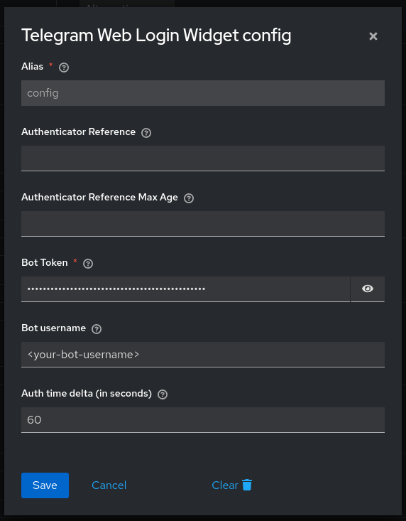
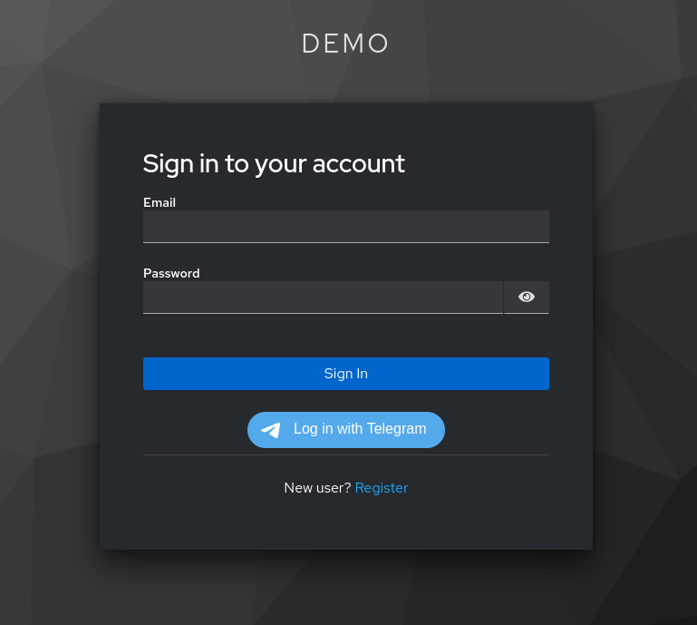
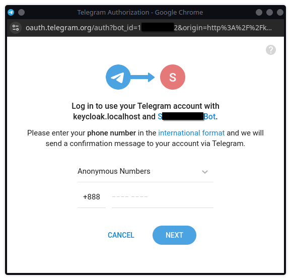
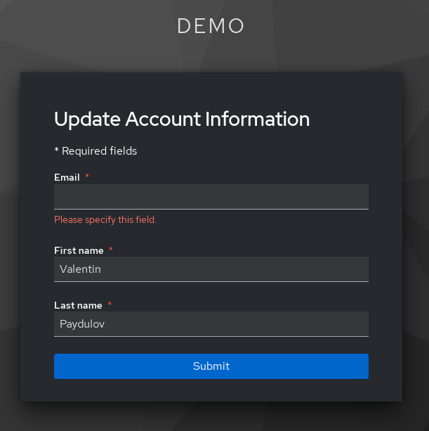
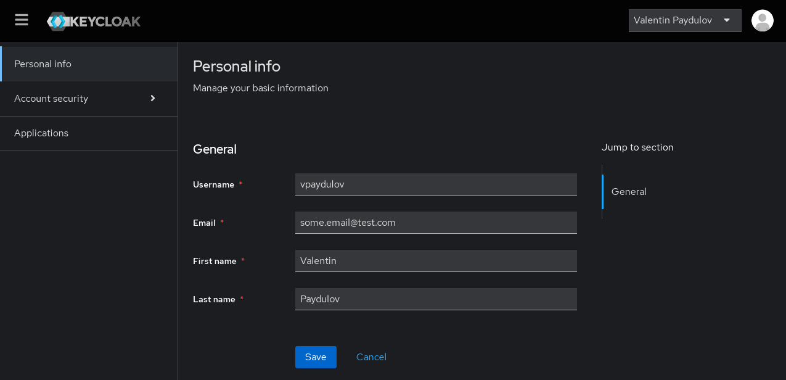

# Telegram Web Keycloak Authenticator


## Contents

*   [What is this?](#what-is-this)
*   [Getting started](#getting-started)
    *   [Requirements](#requirements)
    *   [Install](#install)
    *   [Usage](#usage)
*   [Contribute](#contribute)

## What is this?

The goal of this project is to implement seamless Keycloak authorization via [Telegram Login Widget](https://core.telegram.org/widgets/login).

There are several projects that implement a similar feature but all of them require either user interaction with the bot in the Telegram interface (going to the Telegram application and entering code or generating a link to an external application). Such solutions are good, but a process is inconvenient in many cases and often requires the implementation of additional logic outside Keycloak.

This project, on the other hand, provides the ability to log in without leaving the browser in just a few clicks and does not require the user to perform any special actions.

In addition, the possibilities are not limited only to Browser Flow. You can easily set up authorization through external applications using Implicit Flow with data validation on the Keycloak side.

## Getting Started

For a quick introduction to the features, you can deploy a demo project from this repository using docker-compose. This will deploy Keycloak with this plugin and import a demo realm with pre-configured flows.

### Requirements

* Java 17 or higher installed
* Docker and docker-compose
* You have a Telegram bot, and you know its username and token

### Install

Use git to clone this repository into your computer.

```shell
git clone https://github.com/rickispp/telegram-web-keycloak-authenticator
```

Build project

```shell
./gradlew build
```

Run docker compose

```shell
docker-compose up
```

Send to [@BotFather](https://t.me/BotFather) command for install domain
```shell
/setdomain http://keycloak.localhost
```

Then configure authenticator in Keycloak
* Go to the page http://keycloak.localhost/admin/master/console/#/demo/authentication and log in with the `admin/admin` credentials.
* Select a flow named `Copy of browser`
* Find the `Telegram Web Login Widget` and click on the `Settings` button
* Fill in the fields `Alias`, `Bot Token` and `Bot username` without `@` (e.g. `sample_bot`, not `@sample_bot`) and save configuration



### Usage

* After deployment and configuration, you can go to the page http://keycloak.localhost/realms/demo/account/

* You will see an authorization page that should have an authorization button via Telegram.



* When you click on the button, the Telegram authorization process will start



* After successful authorization, Keycloak will prompt you to enter your email (because this parameter is required in the demo realm settings).



* Finally, by entering an email, you will be redirected to a page with user data. The authorization process has been completed, and a new user has been created in keycloak based on the data received from Telegram.



## How to deploy this on my own Keycloak instance?

### Install

* Download `telegram-web-keycloak-authenticator-x.x.x.jar` from this page https://github.com/rickispp/telegram-web-keycloak-authenticator/releases
* Put the downloaded file in a folder `<YOUR_KEYCLOAK_HOME>/providers/`
* Run or restart your Keycloak instance

### Configure

* Set Bot Domain
  * Send to [@BotFather](https://t.me/BotFather) command
  ```shell
  /setdomain https://<your_keycloak_host>
  ```

* Add authenticator to your flows
  * Go to `Authentication -> Flows -> Browser flow` (Direct grant flow also available).
  * Click on `Add step`, find `Telegram Web Login Widget` and add step.
  * Place `Telegram Web Login Widget` after `Cookie` step and change `Requirement` to `Alternative`.
  * Configure `Telegram Web Login Widget` step by filling `Bot username` and `Bot Token` fields.

* Add Telegram Login Widget to the login page
  * If you are using a standard theme, you can simply change it to `keycloak.v2-telegram-web-login` on the page `Realm settings -> Themes -> Login theme`.
  * If you are using a non-standard theme, then you need to add the Telegram Login Widget script to the login page of your theme
    ```html
    <#if telegram_bot_username?? && telegram_redirect_uri??>
      <div class="telegram-web-login-widget-container">
        <script async src="https://telegram.org/js/telegram-widget.js?22" data-telegram-login="${telegram_bot_username}" data-size="large" data-auth-url="${telegram_redirect_uri}" data-request-access="write"></script>
      </div>
    </#if>
    ```

* Add `Content-Security-Policy`
   * Open your `Realm settings` and go to `Security defenses` tab
   * Edit `Content-Security-Policy` field by adding `https://oauth.telegram.org/` to `frame-src` and `frame-ancestors`. For example `frame-src 'self' https://oauth.telegram.org/; frame-ancestors 'self' https://oauth.telegram.org/; object-src 'none';`

* Check that the configuration is correct
  * Go to your login page. For example, `https://<your_keycloak_host>/realms/<your_realm>/account/`
  * You should see login page with a Telegram authorization button.


## Contribute

Pull requests are welcome. For major changes, please open an issue first to discuss what you would like to change.